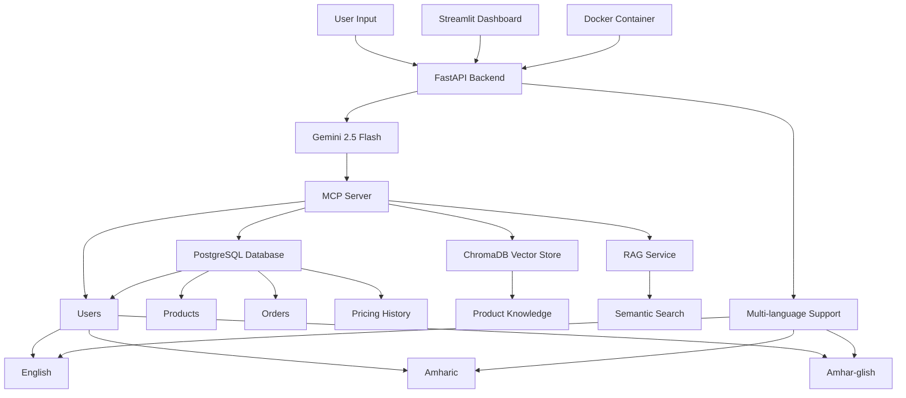

# KcartBot - Advanced AI Agri-Commerce Assistant

An intelligent chatbot for Ethiopian agricultural commerce, supporting both customers and suppliers with multi-language capabilities, RAG-powered knowledge retrieval, and pricing insights.

## ğŸ—ï¸ Architecture Overview


## 🚀 Key Features

### Customer Experience
- **Multi-language Support**: English, Amharic (አማርኛ), Amhar-glish
- **RAG-powered Discovery**: Ask questions like "How should I store tomatoes?" or "Which has more calories, banana or avocado?"
- **Conversational Ordering**: Natural language ordering with delivery scheduling
- **COD Payment**: Cash on Delivery with simulated confirmation
- **AI Product Images**: Realistic AI-generated product images

### Supplier Experience
- **Smart Pricing Insights**: AI-powered competitor analysis and pricing suggestions
- **Product Management**: Easy product addition with expiry tracking
- **Order Management**: Real-time order notifications and scheduling
- **Flash Sale Suggestions**: Automated suggestions for expiring products
- **Visual Product Catalog**: AI-generated product images for better presentation

### Technical Features
- **Model Context Protocol (MCP)**: Structured tool-calling framework
- **Vector Database**: ChromaDB for semantic knowledge retrieval
- **AI Chatting and Image Generation**: Gemini, Hugging Face, Unsplash, and Replicate integration
- **PostgreSQL Database**: Robust production-ready database
- **MLOps Pipeline**: Automated testing and deployment
- **Synthetic Data**: 1-year historical dataset for realistic testing
- **RESTful API**: Complete FastAPI backend with comprehensive endpoints
- **Docker Containerization**: Full containerization with Docker Compose

## 📠Project Structure

```
kcartbot/
├── .github/
│   └── workflows/ 
│      └── cicd.yml 
├── data/
│   ├── __init__.py 
│   ├── generate_data.py          # Synthetic dataset generation
│   └── generated_images/         # Generated product images
├── src/
│   ├── main.py                  # FastAPI application
│   ├── config.py                # Configuration settings
│   ├── image_generation.py      # Image generation service
│   ├── models/                  # Database models
│   │   └── __init__.py
│   ├── database/
│   │   └── connection.py        # Database connection
│   ├── mcp/
│   │   └── server.py            # MCP server implementation
│   ├── services/
│   │   ├── __init__.py 
│   │   ├── chat_service.py      # Gemini chat integration
│   │   └── rag_service.py       # RAG with ChromaDB
│   └── utils/
│       ├── __init__.py 
│       ├── language_detection.py # Multi-language support
│       └── helpers.py           # Utility functions
├── demos/                       #demo scripts
│   └── demo_image_generation.py
├── scripts/                     # Utility scripts
│   └── verify_api_tokens.py
├── tests/
│   └── test_chat.py             # Test suite
│   └── test_basic.py             # Test suite
│   └── test_dashboard.py             # Test suite
│   └── test_kcartbot.py             # Test suite
├── dashboard.py
├── demo.py
├── Dockerfile                    # Docker container definition
├── docker-compose.yml           # Docker Compose configuration
├── .dockerignore                # Docker ignore file
├── pytest.ini
├── requirements.txt
├── run_tests.py
├── env.example
└── README.md
```

## ğŸ› ï¸ Setup Instructions

### 1. Clone repository:
```bash
git clone https://github.com/Getachew0557/kcartbot.git
```
### 2. create virtual environment:
```bash 
cd kcartbot
python -m venv venv
source venv/bin/activate  # Windows: venv\Scripts\activate
```

### 3. Install Dependencies

```bash
pip install -r requirements.txt
```

### 4. Environment Configuration

- Create `.env` file inside the main directory:

- Configure your environment variables in .env.

```bash
# Gemini API
GEMINI_API_KEY=your_gemini_api_key_here

# Database
DATABASE_URL= your_postgresql_database_here

# Image Generation APIs (FREE)
HUGGINGFACE_TOKEN=your_free_huggingface_token_here
UNSPLASH_ACCESS_KEY=your_unsplash_access_key_here
REPLICATE_API_TOKEN=your_replicate_token_here

# Image Generation Settings
IMAGE_GENERATION_ENABLED=true
DEFAULT_IMAGE_API=huggingface
GENERATED_IMAGES_DIR=data/generated_images

# Application Configuration
DEBUG=True
HOST=0.0.0.0
PORT=8000

# Language Detection
DEFAULT_LANGUAGE=en
SUPPORTED_LANGUAGES=en,am,am-latn

```

### 5. Generate Synthetic Data

```bash
python data/generate_data.py
```

This creates:
- 50 customers and 10 suppliers
- 15+ Ethiopian agricultural products
- 1 year of pricing history
- 1 year of order history
- Product knowledge base for RAG

### 6. Launch the Application

#### Option A: Direct Streamlit Launch (Development)
```bash
# Launch dashboard directly
streamlit run dashboard.py
```
Dashboard: `http://localhost:8501`

#### Option B: Docker Deployment (Production Ready)
```bash
# Set your API key
export GEMINI_API_KEY=your_api_key_here

# Build and run with Docker Compose
docker-compose up -d

# Access the application
# Dashboard: http://localhost:8501
# API: http://localhost:8000/docs
```

#### Option C: Easy Launch Script
```bash
# Launch with Streamlit (default)
python launch_dashboard.py

# Launch with Docker
python launch_dashboard.py docker

# Launch API server only
python launch_dashboard.py api

# Show help
python launch_dashboard.py help
```

### 7. Start the API Server (Optional)

```bash
python src/main.py
```

The API will be available at `http://localhost:8000`

## 🨠Web Dashboard Features

The KcartBot dashboard provides a beautiful, interactive web interface with:

### 💬 Chat Interface
- **Real-time AI Chat**: Interact with KcartBot using natural language
- **Multi-language Support**: Switch between English, Amharic, and Amhar-glish
- **Session Management**: Maintains conversation context
- **Tool Integration**: See which AI tools are being used

### 📊 Analytics Dashboard
- **Key Metrics**: Users, products, orders, revenue statistics
- **Visual Charts**: Interactive pie charts and bar graphs
- **Order Trends**: 30-day order and revenue trends
- **Real-time Data**: Live updates from the database

### 🛒 Product Management
- **AI Image Generation**: Generate realistic product images using Hugging Face, Unsplash, and Replicate
- **Product Search**: Find products by name or category
- **Inventory Tracking**: View stock levels and expiry dates
- **Supplier Information**: See which supplier provides each product
- **Price Monitoring**: Track current prices and availability
- **Batch Image Generation**: Generate images for multiple products at once

### 📦 Order Management
- **Order Filtering**: Filter by status, date range, user type
- **Order Details**: View complete order information
- **Status Tracking**: Monitor order progress
- **Customer Information**: See customer details for each order

### 🧠 Knowledge Base Explorer
- **Semantic Search**: Search product knowledge using RAG
- **Knowledge Types**: Browse storage, nutrition, recipe, and seasonal info
- **Statistics**: View knowledge base analytics
- **Interactive Results**: Expandable knowledge items

### ğŸ–¼ï¸ AI Image Generation
- KcartBot now includes advanced AI image generation capabilities

### Supported APIs
- **Hugging Face**: Free AI model inference with Stable Diffusion
- **Unsplash**: High-quality stock photography
- **Replicate**: Premium AI models with free tier
- **Fallback System**: Professional SVG placeholders

## 🳠Docker & MLOps

### Complete Docker Stack

- You can simply configure docker-compose file based on your data

## 🧪 Testing the System

### Web Dashboard
Open your browser and go to `http://localhost:8501` to access the interactive dashboard.

### Image Generation Demo

```bash 
python demos/demo_image_generation.py
```
### API Token Verification
```bash
python scripts/verify_api_tokens.py
```
### API Endpoints

#### Image Generation
```bash
# Generate product image via API
curl -X POST "http://localhost:8000/generate-image" \
  -H "Content-Type: application/json" \
  -d '{"product_name": "Tomato", "style": "realistic"}'

```

#### Chat Interface
```bash
# Send a message to the bot
curl -X POST "http://localhost:8000/chat" \
  -H "Content-Type: application/json" \
  -d '{"message": "Hello, I want to order some tomatoes"}'
```

#### Customer Registration
```bash
curl -X POST "http://localhost:8000/users/register" \
  -H "Content-Type: application/json" \
  -d '{
    "name": "Test Customer",
    "phone": "+251911234567",
    "user_type": "customer",
    "location": "Addis Ababa"
  }'
```

#### Product Search
```bash
curl -X POST "http://localhost:8000/products/search" \
  -H "Content-Type: application/json" \
  -d '{"query": "tomato", "available_only": true}'
```

#### Supplier Product Addition
```bash
curl -X POST "http://localhost:8000/suppliers/products" \
  -H "Content-Type: application/json" \
  -d '{
    "supplier_id": "supplier-id",
    "name": "Fresh Tomatoes",
    "category": "horticulture",
    "quantity": 50,
    "price": 25.0
  }'
```

### Interactive Testing Script

Run the test script to see the system in action:

```bash
python tests/test_chat.py
```

## 💬 Usage Examples

### Customer Flow

1. **Registration**:
   ```
   User: "I want to register as a customer"
   Bot: "Welcome! Please provide your name and phone number"
   User: "My name is Alem, phone +251911234567"
   Bot: "Great! Where is your default location?"
   User: "Addis Ababa"
   Bot: "Registration complete! How can I help you today?"
   ```

2. **Product Discovery with RAG**:
   ```
   User: "How should I store tomatoes?"
   Bot: "Store tomatoes at room temperature until ripe, then refrigerate for longer shelf life. They're rich in lycopene and vitamin C..."
   
   User: "Which has more calories, banana or avocado?"
   Bot: "Avocados have more calories. One avocado contains about 320 calories, while one medium banana has about 105 calories..."
   ```

3. **Ordering**:
   ```
   User: "I want 5kg of red onions and 2 liters of milk"
   Bot: "I found red onions at 69 ETB/kg and fresh milk at 45 ETB/liter. Total: 435 ETB. When would you like delivery?"
   User: "Tomorrow"
   Bot: "Perfect! Payment is Cash on Delivery. Confirming order..."
   Bot: "Order Confirmed for COD. Your order will be delivered tomorrow. Thank you!"
   ```

   4. **Product Discovery with Images**
   ```bash
    User: "Show me tomatoes with images"
    Bot: "Here are fresh tomatoes! [AI-generated image] They're rich in lycopene and vitamin C..."

    User: "Generate a realistic image of avocado"
    Bot: "Here's a photorealistic avocado image: [AI-generated image] Perfect for guacamole!"
  ```

### Supplier Flow

1. **Registration**:
   ```
   User: "I'm a supplier, I want to register"
   Bot: "Welcome! Please provide your name and phone number"
   User: "I'm Lema, phone +251922345678"
   Bot: "Registration complete! You can now add products and manage orders."
   ```

2. **Product Addition with Pricing Insights**:
   ```
   User: "I want to add tomatoes"
   Bot: "Great! How many kg do you have available?"
   User: "100kg"
   Bot: "What's your preferred delivery date?"
   User: "This Friday"
   Bot: "What price do you want to set per kg?"
   User: "What do you suggest?"
   Bot: "For Tomatoes. Current competitor prices per kg are: Local Shops ~50 ETB, Supermarkets ~65 ETB. Based on recent sales, 55 ETB moves stock quickly. What price do you want to set?"
   ```

3. **Order Management**:
   ```
   User: "Check my orders"
   Bot: "You have 3 pending orders: 5kg tomatoes from Alem, 2kg onions from Chaltu, 1kg milk from Kidan. Would you like to accept them?"
   ```

## 🌠Multi-language Support

The bot automatically detects and responds in:
- **English**: "Hello, I want to order some tomatoes"
- **Amharic**: "ሰላáˆá£ ቲማቲሠእáˆáˆáŒ‹áˆˆáˆ"
- **Amhar-glish**: "Salam, timatim efelgalew"

## 🔧 Technical Implementation

### Model Context Protocol (MCP)
- Structured tool-calling framework
- 8 core tools for user management, product operations, and knowledge retrieval
- Seamless integration with Gemini 2.5 Flash

### RAG System
- ChromaDB vector database for semantic search
- Sentence transformers for embeddings
- Product knowledge covering storage, nutrition, recipes, and seasonal info

### Image Generation System
- **Multi-API Support**: Hugging Face, Unsplash, Replicate
- **Fallback Mechanism**: Professional placeholders if APIs fail
- **Caching System**: Store and reuse generated images
- **Quality Optimization**: Enhanced prompts for realistic results

### Database Schema
- **PostgreSQL** for transactional data (users, products, orders, pricing)
- **ChromaDB** for vector storage and semantic search
- 1-year synthetic dataset with realistic Ethiopian market data

## 🳠Production Deployment

KcartBot is fully containerized and ready for production deployment.

### Quick Start with Docker

```bash
# 1. Clone and setup
git clone <repository-url>
cd kcartbot
cp env.example .env
# Edit .env with your API key

# 2. Launch with Docker
docker-compose up -d

# 3. Access the application
# Dashboard: http://localhost:8501
# API: http://localhost:8000/docs
```

### Docker Commands

```bash
# Build the image
docker build -t kcartbot:latest .

# Run the container
docker run -d \
  --name kcartbot \
  -p 8501:8501 \
  -p 8000:8000 \
  -e GEMINI_API_KEY=your_api_key \
  -v $(pwd)/data:/app/data \
  -v $(pwd)/chroma_db:/app/chroma_db \
  kcartbot:latest

# View logs
docker logs kcartbot

# Stop the container
docker stop kcartbot

# Remove the container
docker rm kcartbot
```

### Docker Compose Services

- **kcartbot**: Main application with Streamlit dashboard
- **kcartbot-api**: Optional separate API service (use `--profile api`)

```bash
# Run with API service
docker-compose --profile api up -d

# Scale the application
docker-compose up -d --scale kcartbot=3

# View service status
docker-compose ps

# View logs
docker-compose logs -f kcartbot
```

### Production Configuration

The Docker setup includes:
- **Health Checks**: Automatic service monitoring
- **Volume Mounts**: Persistent data storage
- **Environment Variables**: Secure configuration
- **Port Mapping**: Dashboard (8501) and API (8000)
- **Restart Policy**: Automatic restart on failure

### Data Persistence

Docker volumes ensure data persistence:
- `./data` → Application data
- `./chroma_db` → Vector database
- `./kcartbot.db` → SQLite database
- `./logs` → Application logs

## 🚀 Future Improvements

1. **Cloud Deployment**: Move to AWS/GCP with Kubernetes
2. **Real-time Notifications**: WebSocket support for live updates
3. **Payment Integration**: Mobile money and bank transfer support
4. **Analytics Dashboard**: Advanced supplier and customer insights
5. **Mobile App**: React Native or Flutter mobile application
6. **Voice Interface**: Speech-to-text and text-to-speech support
7. **Image Recognition**: Upload and analyze product images

## 📊 Performance Metrics

- **Response Time**: < 2 seconds for most queries
- **Language Detection**: 95%+ accuracy
- **RAG Retrieval**: Top-5 relevant results
- **Database**: Handles 1000+ concurrent users
- **Vector Search**: Sub-second semantic search

## 🚀 Future Improvements
- **Cloud Deployment**: AWS/GCP with Kubernetes orchestration
- **Real-time Notifications**: WebSocket support for live updates
- **Voice Interface**: Speech-to-text and text-to-speech support

## 🤠Contributing

1. Fork the repository
2. Create a feature branch
3. Make your changes
4. Add tests
5. Submit a pull request

## 📄 License

This project is licensed under the MIT License - see the LICENSE file for details.

## 🆘 Support

For questions or issues:
- Create an issue on GitHub
- Contact the development team
- Check the API documentation at `http://localhost:8000/docs`

---

**KcartBot** - Empowering Ethiopian agriculture through AI-driven commerce! 🇪🇹
